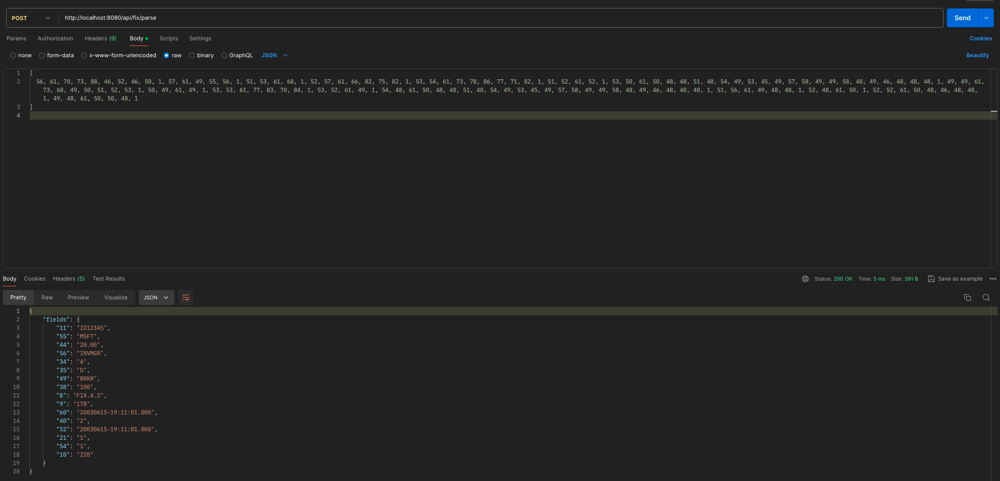

## FIX Parser

### About the project

- This Project is an implementation of FIX parser 

### Technologies involved 

- Java 17
- Junit 5
- SpringBoot

### How to run 

1. Download the application from Git in a directory
2. Please keep the port 8080 free as the application will run on port 8080
3. Run below command from project root directory (use terminal or cmd)
    1. For Mac / Linux
       ```./gradlew bootRun```
4. Go to the below URL using postman to make a POST call http://localhost:8080/api/fix/parse


### Unit testing 



### Benchmark Testing results 

- For the core logic 


- For API 


