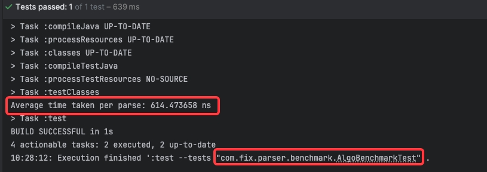
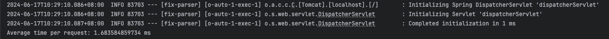

## FIX Parser

### About the project

- This Project is an implementation of FIX parser 

### Technologies involved 

- Java 17
- Junit 5
- SpringBoot

### How to run 

### Benchmark Testing results 

- For the core logic 

- For API 

